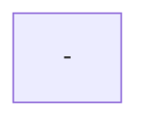
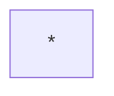
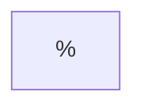
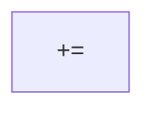
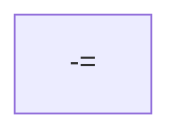
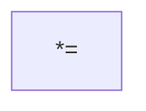
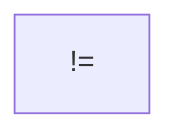
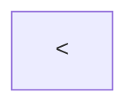
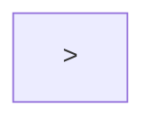
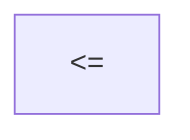

# Arithmetische Operationen
## Addition


Bei der Addition werden 2 Zahlen miteinander aufsummiert.

## Subtraktion


Bei der Subtraktion werden 2 Zahlen voneinander abgezogen

## Multiplikation


Bei der Multiplikation werden 2 Zahlen miteinander mal genommen

## Division
 ```mermaid
graph TD
 /
 ```

Bei der Division werden 2 Zahlen miteinander geteilt
Bei der Division von 2 [[integer|integern]] wird das Ergebnis ohne Rest zurückgegeben:
```java
7 / 3 = 2
```

## Modulo


Bei Modulo wird der Rest einer Divison ausgegeben
```java
7 % 3 = 1
```

## Sonderfälle / Kurzformen
```java

i = i + 5 			| geht auch mit - ; * ; / ; %
ist äquivalent zu
i += 5

i = i + 1			| geht auch mit -
ist äquivalent zu
i++
```
# Zuweisungen
Die Kurzformen sind teilweise auch sogenannte Zuweisungen.
Zuweisungen sind Anweisungen durch die eine Variable einen neuen Wert erhält
## Zuweisungszeichen

## Addition mit Zuweisung / Plusgleich

## Subtraktion mit Zuweisung / Minusgleich

## Multiplikation mit Zuweisung / Malgleich

## Division mit Zuweisung / Durchgleich

## Modulo mit Zuweisung / Modulogleich

# Vergleichsoperatoren
## Gleich

## Ungleich

## Kleiner Als

## Größer Als

## Kleiner Gleich

## Größer Gleich

