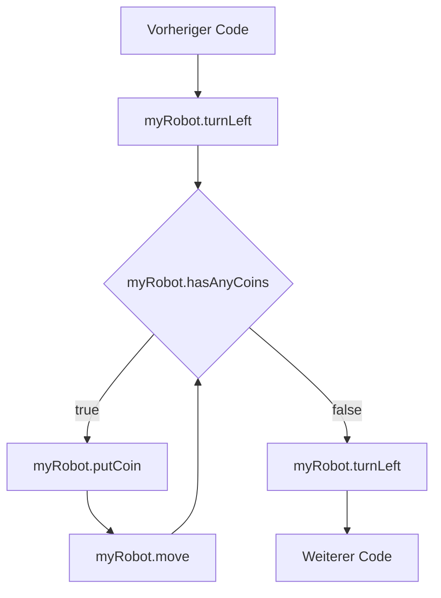
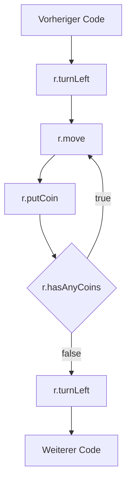

# While-[[Schleife|Schleifen]]
- Ist eine [[Kontrollstruktur]]
```java
...
myRobot.turnLeft();
while(myRobot.hasAnyCoins()){		|Fortsetzungsbedingung
	myRobot.putCoin();				|Schleifenrumpf
	myRobot.move();					|Schleifenrumpf
}
myRobot.turnLeft();
...
```
- Bei While-Schleifen wird die Schleife so lange ausgeführt, solange die Fortsetzungsbedingung (`myRobot.hasAnyCoins()`) noch wahr(`true`) ist
	- Dieser Wert muss im Schleifenrumpf verändert werden um Endlosschleifen zu vermeiden
- Nachdem die Fortsetzungsbedingung nicht mehr erfüllt ist, wird der nachfolgende [[Quellcode]] ausgeführt 

---
Abstrakt kann man den Code oben wie folgt interpretieren:
1. Führe `myRobot.turnLeft();` aus
2. Führe `myRobot.hasAnyCoins()` aus
3. Falls das Ergebnis false ist, springe zu 7
4. Führe `myRobot.putCoin();` aus
5. Führe `myRobot.move();` aus
6. Springe zu 2
7. Führe `myRobot.turnLeft();` aus


# Do-While-Schleife
```java
Robot r = new Robot(1,2,UP,9);
m.turnLeft();
do{
r.move();					|Schleifenrumpf
r.putCoin();				|Schleifenrumpf
} while(r.hasAnyCoins());	|Fortsetzungsbedingung
r.turnLeft();
```
- Bei Do-While-Schleifen wird der Schleifenrumpf immer mindestens einmal ausgeführt, im Vergleich dazu kann bei der While-Schleife dieser auch nie ausgeführt werden, wenn die Fortsetzungsbedingung am Anfang direkt false ist.




- mithilfe von [[break]] können beide Arten von While-Schleifen unterbrochen werden
- mithilfe von [[continue]] können wir den "Rest" der Schleife überspringen, fangen dann wieder von vorne an