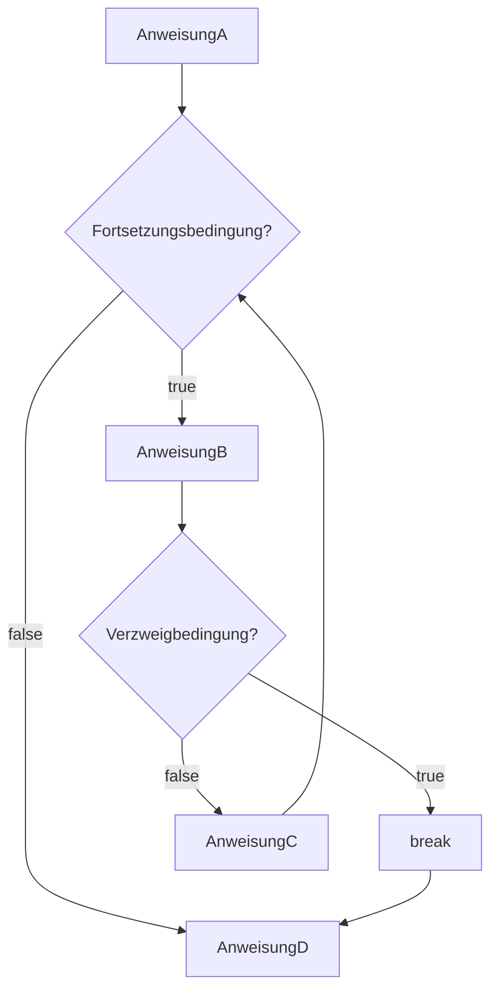

# break
- innerhalb von [[For-Schleife|For-Schleifen]] und [[While-Schleife|While-Schleifen]] anwendbar, um aus ihnen "herauszubrechen", ohne sie fertig auszuführen
>Beispiel:
```java
AnweisungA;
while(fortsetzungsbedingung){
	AnweisungB;
	if(Verzweigbedingung){
		break;
	}
	AnweisungC;
}
AnweisungD
``` 


- Das heißt durch einen `break` wird der [[Quellcode]] direkt nach der Schleife ausgeführt
- Ist in einer Schleife nur sinnvoll, wenn es innerhalb einer [[Verzweigungen|Verzweigung]] steht