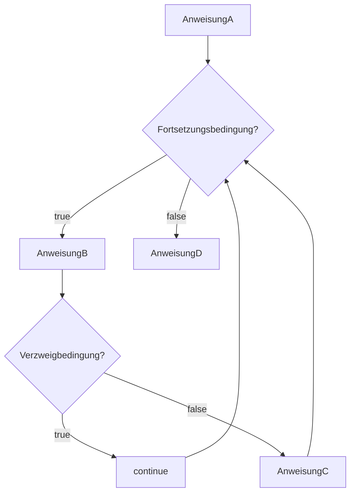

# continue
- innerhalb von [[For-Schleife|For-Schleifen]] und [[While-Schleife|While-Schleifen]] anwendbar, um diese zu "resetten", also um zum Anfang der Schleife zu springen
>Beispiel:
```java
AnweisungA;
while(fortsetzungsbedingung){
	AnweisungB;
	if(Verzweigbedingung){
		continue;
	}
	AnweisungC;
}
AnweisungD
``` 


- Das heißt durch ein `continue` wird die Fortsetzungsbedingung der Schleife erneut abgefragt und abhängig von dieser wird der [[Informatik/Semester_01/FOP/Prozess]] weiter ausgeführt