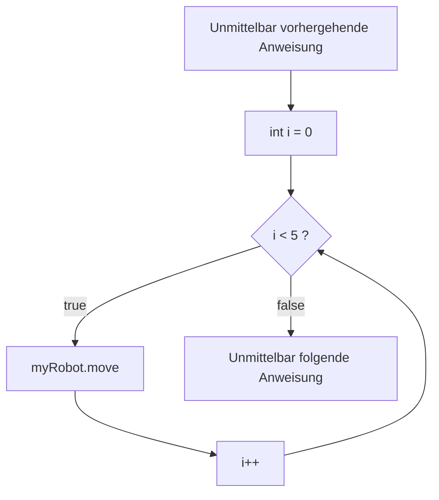

# For-[[Schleife|Schleifen]]
- ist eine [[Kontrollstruktur]]
## Zähl-Schleife
```java
for(int i = 0; i<5; i++){
	myRobot.move();
}
```
- Bei Zähl-Schleifen wird eine Variable auf einen Anfangswert gesetzt(`int i=0`) und so lange die Schleife durchlaufen, bis er mithilfe der Operation(`i++`) die Schleifenbedingung nicht mehr erfüllt(`i<5`)
	- Natürlich kann die "Schleifenvariable" auch während des Schleifenrumpf verändert werden


## "vereinfachte" andere While-Schleife
Eine For-Schleife muss aber nicht unbedingt eine Zähl-Schleife sein
>Beispiel
```java
Robot MyRobot = new Robot(4,6,DOWN,0);
for(Robot r = new Robot(1,2,UP,9);r.hasAnyCoins();r.putCoun()){
	r.move();
	r.turnLeft();
}
myRobot.move();
```
>In diesem Beispiel wird zuerst ein Roboter myRobot eingerichtet
>dann innerhalb der for-Schleife ein neuer Robot r mit 9 Münzen
>Solange dieser Münzen hat
>wird der Schleifenrumpf wird ausgeführt
>>r.move()
>>r.turnLeft()
>Dann legt er eine Münze hin
>Wenn er keine Münzen mehr hat darf der myRobot-Roboter sich bewegen

## geschachtelte For-Schleifen
```java
for(int i = 0; i < 6; i++){
	for(int j = 0; j < 4; j++){
		...
	}
}
```
| i | j |   | i | j |   | i | j |   | i | j |   | i | j |   | i | j |
|---|---|---|---|---|---|---|---|---|---|---|---|---|---|---|---|---|
| 0 | 1 |   | 1 | 1 |   | 2 | 1 |   | 3 | 1 |   | 4 | 1 |   | 5 | 1 |
| 0 | 2 |   | 1 | 2 |   | 2 | 2 |   | 3 | 2 |   | 4 | 2 |   | 5 | 2 |
| 0 | 3 |   | 1 | 3 |   | 2 | 3 |   | 3 | 3 |   | 4 | 3 |   | 5 | 3 |
| 0 | 4 |   | 1 | 4 |   | 2 | 4 |   | 3 | 4 |   | 4 | 4 |   | 5 | 4 |
Bei geschachtelten For-Schleifen müssen die Zähl-Indizes **UNTERSCHIEDLICH** sein, also wie im Beispiel `i` und `j`
Die hier dargestellte geschachtelte For-Schleife kann bspw. verwendet werden um ein Rechteck mit den Seitenlängen von 4x6 auszufüllen 
- mithilfe von [[break]] kann die Schleife unterbrochen werden
- mithilfe von [[continue]] können wir den "Rest" der Schleife überspringen, fangen dann wieder von vorne an

## for-each-Schleife
Wenn wir alle Elemente eines [[Arrays]] durchlaufen möchten, müssen wir das nicht unbedingt mit einer "normalen" For-Schleife machen. Wir können eine sogenannte For-Each Schleife benutzen:
```java
int[] liste = new int[] {0,1,2,3,4,5};
int sum = 0;
for(int element : liste){
	sum += element;
}
System.out.println(sum);
```
