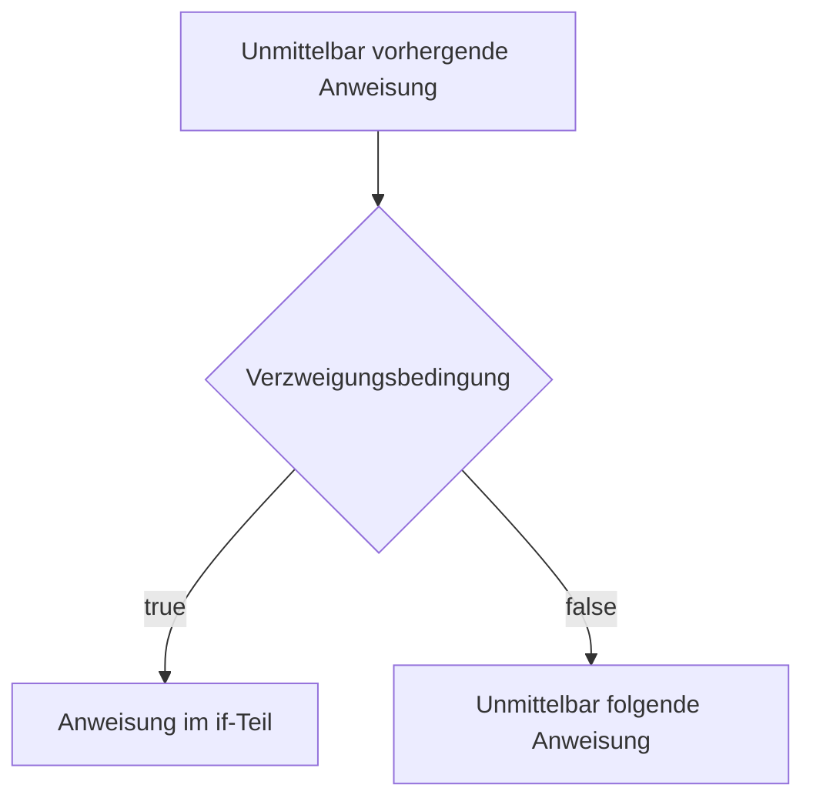
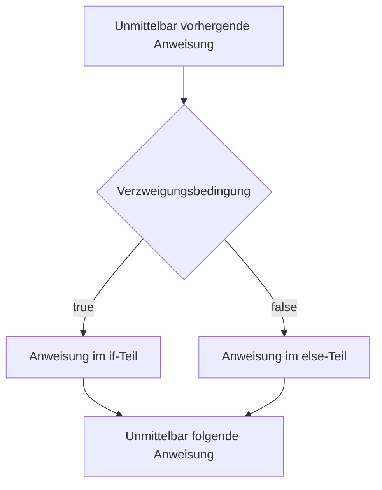

# Verzweigungen
- Sind [[Kontrollstruktur|Kontrollstrukturen]]
## if
Ein Beispiel für Verzweigungen sind einfache if-Verzweigungsbedingung
```java
Unmittelbar vorhergende Anweisung
if(Verzweigungsbedingung){
	Anweisung im if-Teil;
}
Unmittelbar folgende Anweisung

```



## if-else
```java
Unmittelbar vorhergende Anweisung
if(Verzweigungsbedingung){
	Anweisung im if-Teil;
}else{
	Anweisung im else-Teil
}
Unmittelbar folgende Anweisung

```



### Fehlerquelle "dangling else"

```java
if (Bedingung1)
	if(Bedingung2){
		Anweisung1
	}
	else{
		Anweisung2
	}
Anweisung3
```

das else im obrigen Beispiel wird nur ausgeführt, wenn Bedingung1 true und Bedingung2 false ist, es "gehört" also zu der direkt angrenzenden if-Verzweigung
-> Richtiges Einrücken hilft hier ungemein, um Fehler zu vermeiden